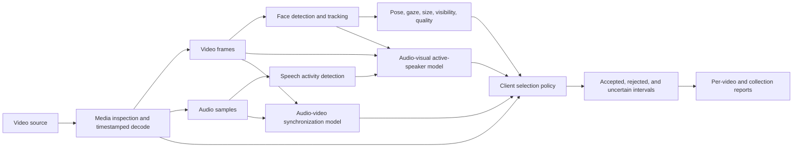

# TalkingFaceKit: Product Direction and Technical Options

> **Discussion and research document — not a description of the current public API.**
>
> This document records the product clarification, technical discussion, research, alternatives,
> and proposed direction agreed during the September 2026 planning conversation. It is intended to
> make the project understandable to teammates who have not participated in that discussion and who
> may not have a background in computer vision, audio processing, or machine learning.
>
> The implemented behavior is still documented in [`README.md`](README.md), and accepted
> architectural decisions remain in [`docs/architecture.md`](docs/architecture.md). Planned APIs
> below are illustrative until implemented, but the product direction and staged backend decision
> are now accepted.

## Decision update — 2026-09-08

The project is a noncommercial computer-science thesis. Commercial licensing is therefore not a
selection gate for the current milestone. Model provenance and terms will still be recorded for
academic reproducibility and to make any future change of use visible.

The feasibility spike is complete. Its evidence changes this document from an open comparison into
an implementation direction:

1. Continue building TalkingFaceKit; do not replace it with an upstream demo.
2. Use **DeepTalk-ASD 0.3.1 as the first experimental active-speaker backend**, behind a narrow
   adapter and never as a type exposed by the core.
3. Timestamped PyAV audio streaming is now implemented. Next build the adapter, then one-video JSON
   and annotated-video outputs.
4. Initially disable DeepTalk's speaker-embedding path on macOS. It is not required to prove active
   speaker detection and currently has a native-linkage problem.
5. Preserve LR-ASD outputs as `raw_score`; do not call them probabilities or use `score > 0` as the
   final policy.
6. Evaluate six deliberately chosen cases before committing further. If the model works and the
   wrapper is manageable, retain DeepTalk. If LR-ASD works but the wrapper is the problem, build a
   focused LR-ASD ONNX adapter. Compare TalkNet only if the model quality is inadequate.
7. Add MediaPipe pose/direct-camera evidence and SyncNet offset estimation as separate later stages.
8. Build the folder/collection workflow only after the single-video report and result contracts are
   proven.

The remainder of this document retains the alternatives and trade-offs that led to this choice.
Those sections provide research context; this decision update is authoritative for current work.

## Executive summary

TalkingFaceKit began as a library for representing and processing talking-head videos, with an early
focus on facial landmarks and animated face meshes. The client has clarified that their real need is
different and substantially more valuable:

1. Open a large collection of arbitrary videos, usually from a folder or dataset.
2. Inspect and validate each source without loading the entire dataset into memory.
3. Find the time intervals where a visible person is genuinely speaking.
4. Prefer intervals where that person is facing or addressing the camera.
5. Reject or flag misleading cases such as an off-screen interviewer, narration over a visible face,
   unrelated or dubbed audio, multiple ambiguous speakers, poor face visibility, or bad media.
6. Report the useful intervals for every video, for example:

   ```text
   video_005.mp4
   - accepted: 00:04.000–00:06.200, visible speaker face_2
   - rejected: 00:06.200–00:08.050, off-screen speech likely
   - accepted: 00:08.050–00:13.000, visible speaker face_2
   ```

The new product is therefore best understood as a **video dataset validation, analysis, and
talking-face segment extraction library**, not primarily as a facial-mesh library.

The central technical conclusion is equally important:

- MediaPipe alone cannot answer all the client's questions.
- We should not build a speaking detector from hand-written mouth-motion rules.
- Existing pretrained models already solve most individual perception problems.
- A few near-complete active-speaker systems exist, including DeepTalk-ASD.
- No single portable Python dependency solves face
  tracking, visible-speaker attribution, direct-to-camera validation, exact lip-sync offset, media
  validation, and project-specific segment selection together.
- TalkingFaceKit should reuse existing models and own only the thin coordination layer: source
  timestamps, backend adaptation, typed results, explainable selection policy, batch operation, and
  reports.

Timestamped audio streaming is now available. The immediate action is a narrow DeepTalk-ASD adapter
followed by a single-video report. Representative clips then determine whether to keep the wrapper,
use LR-ASD more directly, or evaluate TalkNet.

## 1. How the understanding of the project changed

### 1.1 Original working assumption

The original implementation assumed that the principal input would already be a talking-head video:
one person, usually close to the camera, with facial motion worth tracking or converting into a mesh.

That assumption naturally led to features such as:

- video metadata inspection;
- frame streaming;
- a `TalkingFaceSequence` representing a time interval;
- facial landmark extraction;
- conversion from landmarks to a triangular face mesh;
- visualization of that mesh.

Those features are coherent for animation, facial geometry, or avatar workflows. They do not yet
solve the client's dataset-curation problem.

### 1.2 Clarified client workflow

The client has a large, heterogeneous video dataset. Many sources are not talking-head videos. A
single file may contain:

- a person speaking directly to camera;
- the same person looking away;
- another person speaking off camera;
- an interviewer asking a question while the interviewee remains visible;
- narration over unrelated footage;
- multiple visible people;
- scene cuts;
- silence, music, or environmental sound;
- badly synchronized or dubbed audio;
- faces that are too small, blurred, occluded, or short-lived to be useful.

The client wants the library to discover the useful portions rather than assume the entire source is
useful. The eventual workflow should feel approximately like this:

```python
collection = TalkingFaceCollection.from_folder("dataset/raw")
report = collection.analyze()

for video in report.videos:
    for segment in video.accepted_segments:
        print(video.path, segment.start_seconds, segment.end_seconds)
```

This API is illustrative, not a committed design. The important change is that a collection contains
**source videos and analysis results**; it is not merely a container of already-valid
`TalkingFaceSequence` objects.

### 1.3 Revised product statement

> TalkingFaceKit analyzes collections of videos and produces explainable, timestamped intervals in
> which a sufficiently visible, camera-oriented person is likely to be producing the audible speech,
> together with media, quality, ambiguity, and synchronization diagnostics.

This framing allows the project to support dataset filtering first while leaving room for later
landmarks, animation, or 3D processing on the accepted segments.

## 2. The core concept: “talking directly to camera” is a compound decision

It is tempting to look for a model with one output named `talking_directly_to_camera`. In practice,
that phrase contains several independent questions:

```text
A face is visible and tracked
AND audible speech exists
AND that visible face is the source of the speech
AND the head/eyes are oriented acceptably toward the camera
AND the audio and visible motion are synchronized
AND the media and face quality satisfy the dataset policy
```

Each condition can fail while the others remain true:

| Situation | Face visible | Speech audible | Visible face speaking | Facing camera | In sync |
| --- | ---: | ---: | ---: | ---: | ---: |
| Ordinary presenter | Yes | Yes | Yes | Yes | Yes |
| Interviewer speaks off camera | Yes | Yes | No | Maybe | Not measurable for visible face |
| Narration over portrait footage | Yes | Yes | No | Maybe | No meaningful lip relation |
| Presenter looks sideways | Yes | Yes | Yes | No | Yes |
| Silent person smiles or chews | Yes | No | No | Maybe | Not measurable |
| Dubbed or delayed speech | Yes | Yes | Possibly | Maybe | No |
| Two people overlap | Yes, multiple | Yes | Ambiguous or multiple | Varies | Varies |

The final result should therefore not be a mysterious boolean emitted by a black box. It should be
an explainable decision assembled from model observations.



## 3. Problem map and the best known solution for each part

| Problem | Plain-language question | Existing solution class | Leading candidate |
| --- | --- | --- | --- |
| Media validation | Can this file be decoded, and what streams and timestamps does it contain? | Media container library | PyAV, with FFmpeg/ffprobe where necessary |
| Face detection | Is at least one face visible? | Face detector | MediaPipe Face Detector/Landmarker or detector bundled with ASD engine |
| Face tracking | Is this the same face across adjacent frames? | Multi-object/face tracker | Bundled ASD tracker initially; dedicated tracker if evidence requires it |
| Speech activity | Is somebody speaking in the audio? | Voice activity detection | Silero VAD |
| Active speaker detection | Which visible face, if any, is producing the speech? | Audio-visual active-speaker model | LR-ASD via DeepTalk-ASD first; direct LR-ASD/TalkNet only if the gate requires them |
| Head orientation | Is the head approximately frontal? | Face-pose estimation | MediaPipe pose output or a dedicated head-pose model |
| Gaze | Are the eyes approximately directed toward the camera? | Gaze estimation | Dedicated model if licensing and quality are acceptable; otherwise a documented proxy |
| Mouth behavior | Is there visible lip/jaw movement? | Landmarks, blendshapes, or action units | MediaPipe as a diagnostic signal, not the speaking decision |
| Lip sync | Does speech align with the visible mouth, and what is the offset? | Audio-visual synchronization model | SyncNet; evaluate modern `syncnet-python` packaging |
| Audio speaker turns | How many different voices speak and when? | Speaker diarization | pyannote.audio when actually needed |
| Scene boundaries | Did the shot change? | Shot-boundary detector | PySceneDetect when actually needed |
| Final segment selection | Does this interval satisfy this client's dataset rules? | Product policy and temporal aggregation | TalkingFaceKit-owned, explicit rules |

Most perception rows are solved model tasks. The orchestration and final policy are the parts this
project should own.

## 4. Easy explanation of the individual problems

### 4.1 Media validation and normalization

Before applying ML models, the library must understand the source correctly:

- whether a video stream exists;
- whether audio exists;
- encoded width and height;
- codec and pixel format;
- presentation timestamps;
- average or nominal frame rate;
- whether the source uses variable frame rate;
- sample rate, channel count, and channel layout;
- gaps, corrupt packets, missing timestamps, or decode errors;
- rotation and other presentation metadata.

PyAV is already a good boundary for this work because it exposes FFmpeg's media model in Python and
lets us preserve source presentation timestamps. This existing part of TalkingFaceKit is worth
keeping.

“Normalization” needs two different meanings:

1. **Model-input normalization:** create the exact temporary view required by a model, for example
   25 FPS face crops and 16 kHz mono audio for LR-ASD.
2. **Dataset normalization:** deliberately create a new media file with a chosen codec, dimensions,
   frame rate, sample rate, or loudness policy.

These operations must never be conflated. A backend may resample internally for inference while all
public results remain on the original source timeline. The source file should not be silently
rewritten.

### 4.2 Face detection and presence

Face presence is a solved problem and does not require us to manipulate matrices. A face detector
directly returns records like:

```text
bounding_box: x=420, y=110, width=370, height=450
confidence: 0.98
```

If the detector returns a sufficiently confident box, a face is present. From the box we can also
measure directly whether it is large enough and inside the frame.

The harder nearby problem is tracking: assigning a stable local ID such as `face_2` to the same
person over time. Active-speaker pipelines generally need this because they analyze short sequences
of one face rather than disconnected detections.

Track IDs should be local to a video or analysis run. They should not imply that TalkingFaceKit has
recognized a person's real-world identity. Cross-video face recognition is a separate biometric and
privacy-sensitive capability.

### 4.3 Speech activity detection

Voice activity detection answers only:

> Is human speech present in the audio during this interval?

It does not answer who is speaking or whether that person is visible. Silero VAD is a strong,
actively maintained, MIT-licensed candidate. It supports common speech sample rates and has both
PyTorch and ONNX execution paths.

MediaPipe's Audio Classifier with YAMNet can classify events such as speech, music, and noise. It is
useful for a low-dependency baseline or broader audio labeling, but it is an audio-event classifier,
not a purpose-built segmentation VAD. Silero is the better production candidate for precise speech
boundaries.

### 4.4 Mouth motion

MediaPipe can expose facial blendshape values such as jaw opening and mouth closing. Landmarks also
make it possible to measure changes in lip geometry over time.

That information is useful for:

- explaining a result;
- diagnosing tracking failure;
- measuring how visually active a segment is;
- handling a source without audio;
- producing animation signals later.

It should **not** be the primary speaking classifier. A smile, yawn, chewing motion, or silent lip
movement can look like speech. Conversely, some phonemes produce very little visible mouth motion.

The active-speaker model should determine speaking. Mouth-motion metrics should remain optional
evidence and diagnostics.

### 4.5 Active speaker detection: the key client problem

Active speaker detection combines a tracked face sequence with synchronized audio and returns a
model score indicating whether the visible face may be producing that speech.

```text
face track + mouth-region frames + audio features
                         |
                         v
             active-speaker raw score
```

This is what distinguishes a visible interviewee from an off-screen interviewer. It also handles
multiple visible faces by assigning scores per face track.

The selected first model path is LR-ASD through DeepTalk-ASD, a lightweight active-speaker model.
The published work
reports approximately 0.84 million parameters, 0.51 GFLOPs, and 94.5% mAP on the AVA ActiveSpeaker
validation benchmark. Benchmark scores do not guarantee performance on the client's videos, so a
domain-specific evaluation is still required.

TalkNet is an older and widely referenced alternative. Its research repository demonstrates the
complete pipeline but assumes an older Python/Conda environment and a file-heavy preprocessing
workflow. It is useful as a comparison or fallback, not the preferred integration today.

### 4.6 Head direction and “directly to camera”

Head direction and gaze are related but different:

- **Head pose:** where the face/head is pointed.
- **Gaze:** where the eyes are looking.

A presenter can keep their head frontal while glancing at notes. A person can also turn their head
slightly while keeping their eyes on the camera.

MediaPipe's face transformation output represents head pose. An adapter can convert that standard
representation once and expose ordinary values such as:

```text
yaw: 8 degrees
pitch: -3 degrees
roll: 2 degrees
frontal: true
```

The application and user do not need to perform matrix operations. This conversion is deterministic
adapter plumbing, not a new perception algorithm.

MediaPipe also exposes eye-related blendshapes and iris landmarks, but they are better treated as an
attention proxy than as calibrated eye contact. Dedicated gaze models exist, but many popular
pretrained weights were trained on datasets with research-only or noncommercial terms. Those terms
are compatible with the current thesis scope when followed, but still belong in provenance and
would need a new review for another use.

An early product policy may reasonably use “sufficiently frontal head” rather than promise precise
eye contact. The client should decide whether occasional gaze away from the camera is acceptable.

### 4.7 Audio-video synchronization

Active-speaker detection and synchronization are related but are not the same output.

- Active-speaker detection asks: **Does this face/audio pair look like the face is speaking?**
- Synchronization asks: **How far must the audio be shifted to align with the visible mouth?**

SyncNet was designed to estimate audio-video offset and confidence for speech video. A result might
say:

```text
estimated_offset_ms: +120
confidence: 9.8
```

Synchronization is not always measurable. If the audio contains narration but no visible speaking
face, the honest output is `not_measurable`, not simply `out_of_sync`. The same applies to extremely
short speech, a covered mouth, a tiny face, or weak model confidence.

### 4.8 Final segment assembly

Models produce noisy per-frame or per-window scores. The client wants stable time intervals.
TalkingFaceKit must therefore own a small amount of temporal policy:

- score thresholds;
- minimum segment duration;
- whether short gaps are joined;
- how scene cuts affect tracks;
- how long a face may be missing;
- whether ambiguous overlaps are rejected;
- acceptable pose and face-size ranges;
- acceptable synchronization offset;
- how uncertainty is represented.

For illustration only:

```text
accept an interval when:
  active_speaker_confidence >= configured threshold
  AND face is sufficiently large and visible
  AND head pose is sufficiently frontal
  AND sync is acceptable or explicitly not required
  AND the condition lasts at least the minimum duration
```

These should be named, configurable product rules—not magic values buried inside model adapters.

## 5. What is implemented today

TalkingFaceKit `0.1.0` currently provides a clean but narrower vertical slice.

### 5.1 Core media and sequence behavior

- `VideoSource` stores the source path and complete-stream metadata.
- `VideoMetadata` records dimensions, average FPS when known, reported duration when known, and
  whether an audio stream exists.
- `TalkingFaceSequence` represents a half-open interval on the source timeline.
- `TalkingFaceSequence.from_video(...)` inspects a local video without retaining decoded media.
- `TalkingFaceSequence.clip(...)` creates a lightweight sub-interval sharing the same source.
- PyAV-based frame streaming yields one RGB `uint8` frame at a time.
- Frame indices and presentation timestamps come from the source rather than being invented from
  FPS.
- Processing is bounded-memory unless a caller deliberately retains frames.

### 5.2 Current facial tracking

- An optional MediaPipe Face Landmarker adapter processes one face.
- It stores 478 `(x, y, z)` landmarks per decoded frame.
- It preserves missing frames with a detection mask and `NaN` landmark values.
- It stores named results transactionally on the sequence.
- It does not download the MediaPipe model; the user supplies the `.task` asset.

### 5.3 Current persistence and visualization

- Landmark tracks can be saved to and loaded from a versioned compressed NPZ format.
- MediaPipe's first 468 landmarks can be converted to its official 852-triangle surface.
- An optional Plotly renderer creates a self-contained animated HTML mesh viewer.
- CLI commands exist for landmark extraction, landmark inspection, and mesh rendering.

### 5.4 Existing strengths worth preserving

- Source timestamps are treated carefully.
- Media I/O is isolated behind an integration boundary.
- Core data types do not contain PyAV, MediaPipe, Plotly, PyTorch, or OpenCV objects.
- Model assets are explicit rather than silently downloaded.
- Results preserve missing observations rather than deleting frames.
- Operations attach completed results only after successful processing.
- Optional dependencies are separated from the core.
- Unit tests are fast, deterministic, and do not download large assets.

### 5.5 Gaps relative to the clarified product

- No audio samples are decoded or streamed yet.
- No voice activity detection exists.
- Only one face is tracked.
- There are no stable multi-face tracks.
- No active-speaker detector exists.
- No head-pose or gaze result is exposed.
- No audio-video synchronization analysis exists.
- No accepted/rejected/uncertain interval model exists.
- No per-video analysis report exists.
- No folder or dataset collection workflow exists.
- The main abstraction is still mesh/sequence-oriented rather than report/segment-oriented.

The implementation is not wasted. The media boundary, timestamps, validation practices, and
framework-independent core are good foundations. The product center of gravity needs to move.

## 6. Candidate libraries and systems

### 6.1 PyAV — keep

**Purpose:** media inspection, video/audio decoding, timestamp access, resampling primitives, and
eventual encoding.

**Pros**

- Already integrated successfully.
- Gives direct access to FFmpeg's media model.
- Works with source presentation timestamps.
- Supports streaming rather than loading complete videos.
- Avoids shelling out for ordinary decode operations.

**Cons**

- Low-level enough that TalkingFaceKit must define its own clear frame and audio contracts.
- Some validation details may still benefit from ffprobe or explicit FFmpeg behavior.
- Model-specific transforms such as fixed 25 FPS crops remain our responsibility at the integration
  boundary.

**Decision:** retain as the media boundary. Do not replace it with OpenCV video capture merely
because some research demos use OpenCV.

### 6.2 MediaPipe Face Landmarker — retain, but change its role

**Purpose:** face presence, landmarks, facial expressions/blendshapes, head-pose source data, and
visual diagnostics.

The official Face Landmarker can provide:

- a complete face mesh;
- 478 landmarks;
- 52 blendshape scores;
- facial transformation matrices;
- multiple-face configuration;
- video/live-stream tracking behavior.

The current TalkingFaceKit adapter explicitly disables blendshapes and transformation matrices. They
can be enabled later if MediaPipe remains the visual-quality backend.

**Pros**

- Maintained by Google.
- Cross-platform and suitable for local execution.
- One model bundle covers detection, landmarks, expressions, and pose-related output.
- Already familiar within the codebase.
- Avoids adding a separate model for every small visual measurement.
- Apache-licensed project code and a much safer commercial starting point than many academic face or
  gaze toolkits.

**Cons**

- Does not determine which visible person is producing the audio.
- Eye-related output is not equivalent to calibrated eye contact.
- The model is optimized primarily for selfie/front-facing use and degrades with extreme pose,
  distance, occlusion, overlap, motion, and poor lighting.
- Our current adapter handles only one face.

**Decision:** do not use MediaPipe as the active-speaker solution. Keep it as the leading visual
quality and pose candidate unless the active-speaker backend already supplies better equivalent
data.

Official documentation:
[MediaPipe Face Landmarker](https://developers.google.com/edge/mediapipe/solutions/vision/face_landmarker/index).

### 6.3 Silero VAD — preferred speech detector

**Purpose:** speech versus non-speech intervals.

**Pros**

- Focused specifically on voice activity detection.
- Small, widely used, actively maintained, and MIT licensed.
- Supports common speech sample rates and many languages.
- PyTorch and ONNX paths are available.
- Already included inside DeepTalk-ASD's full pipeline.

**Cons**

- The normal standalone Python package brings PyTorch and torchaudio dependencies.
- ONNX-only use may require a narrower adapter instead of installing its complete package.
- VAD still cannot identify the visible speaker.

**Decision:** use the copy integrated with the chosen ASD system when possible. Avoid a second
top-level VAD integration unless the active-speaker backend does not provide it.

Official repository: [Silero VAD](https://github.com/snakers4/silero-vad).

### 6.4 MediaPipe Audio Classifier with YAMNet — optional baseline

**Purpose:** classify audio events such as speech, music, and environmental sounds.

**Pros**

- Reuses the MediaPipe runtime.
- Useful for recognizing more than speech alone.
- Can provide a rapid baseline without introducing PyTorch.

**Cons**

- It is an event classifier rather than a dedicated VAD.
- Its windows and decisions may be too coarse for precise speech boundaries.
- It does not identify a visible speaker.

**Decision:** useful for experiments or broad audio labels, but not the leading production VAD.

Official documentation:
[MediaPipe Audio Classifier](https://developers.google.com/edge/mediapipe/solutions/audio/audio_classifier).

### 6.5 LR-ASD — preferred open active-speaker model

**Purpose:** estimate whether each tracked visible face is actively speaking.

LR-ASD is a lightweight successor in the Light-ASD line. It consumes audio features and sequences of
face/mouth crops. The official repository and 2025 paper report strong AVA ActiveSpeaker performance
with a comparatively small model.

**Pros**

- Directly addresses the client's hardest question.
- Lightweight compared with older active-speaker models.
- Evaluated on multiple datasets in the published work.
- Official code and model weights are available.
- An ONNX conversion exists through DeepTalk-ASD, enabling CPU inference without PyTorch.

**Cons**

- The official repository is research code, not a polished PyPI library.
- Its demo makes assumptions about 25 FPS video, 16 kHz mono audio, face crops, and auxiliary tools.
- Benchmark performance must be validated against the client's domain.
- Code license and every model asset's distribution/use terms still require explicit review.

**Decision:** leading local model candidate. Prefer a clean ONNX integration or a proven package
wrapper over running the original end-to-end demo scripts.

Sources: [LR-ASD repository](https://github.com/Junhua-Liao/LR-ASD) and
[LR-ASD paper](https://junhua-liao.github.io/Junhua-Liao/publications/papers/IJCV_2025.pdf).

### 6.6 TalkNet — credible fallback/reference

**Purpose:** audio-visual active-speaker detection.

**Pros**

- Established and widely referenced ASD approach.
- Demonstrates the complete face-track, crop, audio-feature, and classification pipeline.
- Official implementation is MIT licensed.
- Can help benchmark or validate LR-ASD behavior.

**Cons**

- The official setup is based on Python 3.7.9 and Conda.
- The demo writes many intermediate frames, audio files, clips, and pickle files.
- It relies on an older research-oriented dependency stack.
- Adopting the demo pipeline directly would conflict with TalkingFaceKit's timestamp and I/O design.

**Decision:** fallback and comparison, not the first backend.

Official repository: [TalkNet-ASD](https://github.com/TaoRuijie/TalkNet-ASD).

### 6.7 DeepTalk-ASD — closest local “one library” option

**Purpose:** a complete local active-speaker system.

DeepTalk-ASD appeared on PyPI in March 2026. It packages:

- InspireFace detection and tracking;
- Silero VAD;
- LR-ASD converted into three ONNX models;
- speaker embeddings through Sherpa-ONNX/WeSpeaker;
- speaker verification and profile updates;
- real-time and offline demos;
- automatic or offline model management;
- an API returning scores by face-track ID.

Its optional speaker-verification layer may later help compare a voice with a profile. It is not
required for the first active-speaker milestone and will be disabled initially on macOS because the
spike found a Sherpa-ONNX linkage problem.

Example conceptual use:

```python
asd = ASDDetectorFactory().create()

asd.append_video(video_frame, timestamp)
asd.append_audio(audio_frame, timestamp)
scores = asd.evaluate(start_time, end_time)
# {track_id: active_speaker_score}
```

**Pros**

- Closest match to the desired plug-in experience.
- Integrates multiple necessary models behind one API.
- Uses ONNX Runtime and claims CPU-real-time operation.
- Avoids a mandatory PyTorch/CUDA environment.
- Supports offline model caching.
- Code is MIT licensed.
- Its architecture already separates face, turn, and speaker detectors.

**Cons and audit findings**

- Very new, with only two PyPI releases at the time of research.
- One PyPI maintainer and a small current user/community base.
- No automated test suite was found in the repository during the source audit.
- The released manifest pins NumPy to `1.26.4`, while TalkingFaceKit currently requires NumPy
  `2.4.6` or newer.
- Some libraries imported by source code are not directly listed in the declared dependencies.
- Its offline demo is OpenCV/FFmpeg-oriented and needs adaptation to source timestamps.
- Its implementation documentation is largely Chinese, which may raise maintenance costs for this
  team.
- The default InspireFace model assets are restricted to academic/noncommercial use according to
  InspireFace's official documentation.
- Being labeled “industrial-grade” by its author is not a substitute for independent validation.

**Decision update:** the compatibility spike passed for the noncommercial thesis. Proceed with
DeepTalk-ASD as an experimental backend behind a narrow adapter. It is not an unexamined
foundational dependency: timing, determinism, buffers, raw-score semantics, dependency isolation,
and native failures remain TalkingFaceKit integration concerns.

Sources: [DeepTalk-ASD on PyPI](https://pypi.org/project/deeptalk-asd/),
[DeepTalk-ASD repository](https://github.com/huyyxy/DeepTalk-ASD), and
[InspireFace license statement](https://github.com/HyperInspire/InspireFace/blob/master/README.md#license).

### 6.8 NVIDIA Active Speaker Detection NIM — strongest turnkey production option

**Purpose:** production active-speaker inference as a hosted or self-hosted NVIDIA service.

The NIM accepts video, audio, and diarization data and returns per-frame:

- speaker bounding boxes;
- audio diarization speaker IDs;
- face IDs;
- active-speaking booleans;
- face-detection confidence.

It can track multiple speakers across cutscenes and has streaming and transactional modes.

**Pros**

- Most production-shaped complete solution found in the research.
- Directly returns the central client-facing answer.
- Handles multiple speakers and cutscenes.
- Includes GPU-accelerated decoding and inference.
- NVIDIA documents multi-input concurrency and performance on supported GPUs.
- A gRPC boundary would keep proprietary runtime objects outside TalkingFaceKit's core.

**Cons**

- Not a lightweight Python dependency; it is a service/container integration.
- Self-hosting requires supported NVIDIA hardware, Linux, Docker, CUDA, TensorRT, Triton, and NVDEC.
- Requires diarization information as an input, introducing another upstream step.
- Hosted use introduces network, privacy, cost, credentials, availability, and file-limit concerns.
- The hosted interface currently documents H.264 MP4 input and a 500 MB limit.
- It still does not replace a direct-to-camera quality model or an explicit lip-sync-offset model.
- Product and model licensing/usage terms must be reviewed separately from ordinary open-source
  dependencies.

**Decision:** a credible turnkey option when NVIDIA infrastructure, proprietary deployment, and
diarization are acceptable, but not part of the current local thesis implementation path.

Sources: [NVIDIA NIM overview](https://docs.nvidia.com/nim/maxine/active-speaker-detection/latest/overview.html),
[input/output documentation](https://docs.nvidia.com/nim/maxine/active-speaker-detection/latest/basic-inference.html),
[support matrix](https://docs.nvidia.com/nim/maxine/active-speaker-detection/latest/support-matrix.html), and
[performance results](https://docs.nvidia.com/nim/maxine/active-speaker-detection/latest/performance-results.html).

### 6.9 SyncNet and `syncnet-python` — preferred lip-sync direction

**Purpose:** estimate audio-video speech offset and confidence.

The original SyncNet system explicitly supports temporal offset detection and identifying the likely
speaker among multiple face tracks. A modern `syncnet-python` package claims Python 3.9–3.13
support, batch processing, automatic S3FD face tracking, and a direct Python pipeline.

**Pros**

- Produces the exact type of result the client asked about: offset plus confidence.
- Designed specifically for speech and visible mouth synchronization.
- The modern package offers a much easier API than the original research environment.
- CPU execution is available, with CUDA optional.

**Cons**

- The modern package is marked beta and has one maintainer.
- Some published project links still contain placeholder `yourusername` URLs.
- Its performance claims appear to be based on small example inputs rather than a broad independent
  evaluation.
- It brings PyTorch, OpenCV, SciPy, NumPy, pandas, FFmpeg, face-detector weights, and SyncNet weights.
- It should return `not_measurable` on unsuitable material rather than force a sync conclusion.

**Decision:** evaluate the modern package, but place it behind a small synchronization adapter so it
can be replaced by the original model or another implementation if packaging quality is inadequate.

Sources: [original SyncNet](https://github.com/joonson/syncnet_python) and
[`syncnet-python` on PyPI](https://pypi.org/project/syncnet-python/).

### 6.10 Synchformer — modern but currently too heavy

**Purpose:** general audio-visual temporal offset and synchronizability prediction.

**Pros**

- Newer synchronization research.
- Works on broader audiovisual events, not only speech mouths.
- Predicts both offset and whether streams are meaningfully synchronizable.
- Published pretrained models and evaluations exist.

**Cons**

- Research-oriented installation and configuration.
- Large feature extractors and GPU emphasis.
- Its repository recommends old PyAV versions for reproducibility, conflicting with this project.
- Much more infrastructure than the first talking-face validation slice needs.

**Decision:** monitor or benchmark later; do not use as the first synchronization dependency.

Official repository: [Synchformer](https://github.com/v-iashin/Synchformer).

### 6.11 pyannote.audio — excellent audio diarization, optional here

**Purpose:** determine speaker turns and anonymous audio speaker identities such as `speaker_0` and
`speaker_1`.

**Pros**

- Mature Python-first speaker-diarization toolkit.
- Strong pretrained pipelines.
- Handles speech activity, speaker changes, overlap, and speaker embeddings.
- Useful when mapping visible faces to continuing voices across cuts.
- Can provide the diarization input required by NVIDIA NIM.

**Cons**

- Heavy PyTorch-based dependency stack.
- Requires model access and acceptance of Hugging Face model conditions for common pipelines.
- Audio diarization alone cannot tell which face is speaking.
- Unnecessary for the first local LR-ASD experiment unless a use case proves the need.

**Decision:** add only when anonymous voice identity, overlap analysis, or NVIDIA's required
diarization input becomes part of the chosen path.

Official repository: [pyannote.audio](https://github.com/pyannote/pyannote-audio).

### 6.12 PySceneDetect — good optional shot detector

**Purpose:** identify cuts and shot boundaries.

**Pros**

- Focused, established library.
- Supports multiple cut-detection algorithms.
- Has a Python API and PyAV support.
- Avoids writing our own visual change detector.

**Cons**

- Adds another dependency, commonly including OpenCV.
- Shot detection is not necessary to prove active-speaker analysis.
- A robust face tracker or ASD engine may already handle some cut behavior.

**Decision:** integrate when observed face-track failures at cuts or shot-aware segment rules justify
it.

Official repository: [PySceneDetect](https://github.com/Breakthrough/PySceneDetect).

### 6.13 OpenFace 3.0 — comprehensive visual toolkit, licensing blocker

**Purpose:** face detection, landmarks, gaze, facial action units, and emotion.

**Pros**

- One toolkit returns many visual observations directly.
- Gaze is exposed as yaw and pitch rather than requiring application-level matrix work.
- Useful research reference for direct-to-camera analysis.

**Cons**

- The software license explicitly permits only academic/nonprofit noncommercial research.
- PyTorch/OpenCV-based dependency stack.
- Does not solve visible-speaker attribution or lip-sync offset by itself.

**Decision:** do not use as the default foundation for a client-facing library without a separate
commercial license.

Sources: [OpenFace 3.0](https://github.com/CMU-MultiComp-Lab/OpenFace-3.0) and
[license](https://github.com/CMU-MultiComp-Lab/OpenFace-3.0/blob/main/LICENSE).

### 6.14 Py-Feat — attractive all-in-one visual API, unsuitable default license

**Purpose:** faces, landmarks, blendshapes, pose, gaze, action units, and emotion.

**Pros**

- Very convenient multi-task visual analysis.
- Direct high-level outputs.
- Good for research and exploratory notebooks.

**Cons**

- Its main multi-task model is documented for noncommercial research use.
- Heavy PyTorch-based stack and automatic weight download behavior.
- Overlaps MediaPipe without solving the central active-speaker question.

**Decision:** not the default product backend.

Official model documentation: [Py-Feat models](https://py-feat.org/pages/models/).

## 7. Main implementation strategies

### Approach A: extend MediaPipe and combine hand-written signals

This approach would use face presence, mouth movement, head pose, eye direction, and an audio speech
detector, then combine them with rules.

**Pros**

- Reuses the current integration.
- Local and cross-platform.
- Relatively small dependency set.
- Easy to expose interpretable measurements.
- Useful for visual suitability and debugging.

**Cons**

- Mouth motion is not reliable proof of speech.
- Cannot robustly solve off-screen narration or interviewer audio.
- Requires extensive threshold tuning.
- Risks creating a fragile approximation to a problem already addressed by active-speaker models.
- Could appear to work on simple demos while failing on the client's difficult cases.

**Verdict:** unsuitable as the principal speaking detector. Use only for visual-quality filters and
diagnostics around a real ASD model.

### Approach B: plug in DeepTalk-ASD as the complete local engine

TalkingFaceKit would adapt source video/audio into DeepTalk-ASD and convert its results into our
typed timeline and reports.

**Pros**

- Fastest route to a local end-to-end proof.
- One package already includes face tracking, VAD, ASD, and speaker verification.
- ONNX CPU execution avoids PyTorch.
- Directly tests the hardest client scenario.

**Cons**

- Immature package and small maintenance community.
- Dependency conflict with current NumPy.
- Default face model has noncommercial restrictions.
- Offline source-timestamp behavior needs careful validation.
- We would inherit upstream API and packaging weaknesses if tightly coupled.

**Verdict:** preferred first experiment, not an automatic long-term commitment. Integrate behind a
narrow boundary and be prepared to replace its face detector or reuse only its ONNX ASD components.

### Approach C: use NVIDIA NIM as the active-speaker service

TalkingFaceKit would send supported media and diarization data through a gRPC backend, then convert
per-frame results into portable core types.

**Pros**

- Strongest turnkey production offering found.
- Built for concurrency and large-media streaming.
- Direct multi-speaker and cross-cut outputs.
- NVIDIA owns most low-level optimization and deployment complexity.

**Cons**

- Requires NVIDIA infrastructure or a hosted service.
- Proprietary operational and commercial dependency.
- Needs diarization first.
- Less portable and not fully local on ordinary developer machines.
- Still requires separate direct-camera and explicit synchronization validation.

**Verdict:** excellent if deployment constraints allow it. It should be evaluated with the client
rather than rejected for being non-Python or proprietary.

### Approach D: compose a small curated local stack

TalkingFaceKit would use stable runtimes and selected pretrained models:

```text
PyAV                  media and source timestamps
MediaPipe             face/pose/visual quality
LR-ASD through ONNX   visible active speaker
Silero through ONNX   speech activity, if not bundled with ASD path
SyncNet               explicit lip-sync offset
```

**Pros**

- Local, backend-controlled, and potentially cross-platform.
- Avoids depending on a single immature wrapper.
- Reuses the actual pretrained perception models rather than reimplementing them.
- Can keep PyTorch out of the default runtime by preferring ONNX.
- Lets us enforce TalkingFaceKit's timestamp, typing, model-asset, and test policies.
- Each major component can be replaced independently.

**Cons**

- We own more integration and preprocessing code.
- Model-specific crop/audio contracts must be implemented carefully.
- Asset licensing and versioning remain our responsibility.
- More initial engineering than directly installing DeepTalk-ASD.

**Verdict:** the fallback when LR-ASD behavior is useful but the DeepTalk wrapper blocks progress.
Do not build it in parallel with the first adapter; activate this path only from the six-case gate.

### Approach E: use a general multimodal language model

A large vision-language model could be prompted with sampled video frames or clips and asked whether
a person appears to be speaking to camera.

**Pros**

- Flexible semantic reasoning.
- Minimal task-specific code for demonstrations.
- Can explain scene content in natural language.

**Cons**

- Poor fit for precise frame-level timestamps and millisecond synchronization.
- High cost for large datasets.
- Results can be nondeterministic and difficult to calibrate.
- Upload/privacy constraints may be unacceptable.
- Temporal sampling can miss short segments.
- Harder to benchmark and reproduce than focused models.

**Verdict:** potentially useful as a secondary reviewer or metadata generator, not the primary
segment detector.

## 8. Recommended direction

### 8.1 Product direction

Reframe TalkingFaceKit around **analysis reports and detected intervals**. Facial landmarks and
meshes become optional artifacts that can support analysis or downstream animation, rather than the
main reason the library exists.

### 8.2 Technical direction

Use an actual audio-visual active-speaker model as the central perception component. Do not build the
core result from mouth-motion heuristics.

The current implementation order is:

1. Add timestamped PyAV audio streaming.
2. Integrate DeepTalk-ASD as a narrow experimental backend.
3. Produce and evaluate the one-video JSON report and diagnostic overlay.
4. Keep DeepTalk if it passes; use direct LR-ASD ONNX only if its wrapper is the limiting factor;
   compare TalkNet only if LR-ASD model behavior is inadequate.
5. Use MediaPipe for face suitability, pose, and diagnostics—not for deciding who produced the
   audio.
6. Add SyncNet as a separate explicit synchronization capability once active-speaker output works.
7. Add pyannote, PySceneDetect, or dedicated gaze models only after real failures demonstrate their
   need.

### 8.3 Why this is not “reinventing the wheel”

TalkingFaceKit would not implement:

- a face neural network;
- a VAD neural network;
- an active-speaker neural network;
- a gaze neural network;
- a synchronization neural network.

It would implement the small but unavoidable product layer:

- decode inputs once and preserve their timestamps;
- prepare documented model-specific views;
- call pretrained engines;
- convert outputs into backend-independent records;
- merge noisy observations into time intervals;
- apply explicit client criteria;
- explain why each interval was accepted, rejected, or left uncertain;
- run the process reproducibly over a folder.

No external library can know the client's definition of a useful training example. Owning that final
policy is a feature, not duplicated research.

## 9. Proposed conceptual architecture

Names below are illustrative. They should be introduced only as real vertical slices need them.

```text
src/talkingfacekit/
├── analysis.py              VideoAnalysis, SegmentDecision, reasons
├── collection.py            Folder/dataset discovery and batch orchestration
├── media.py                 Existing source metadata and frame contracts
├── audio.py                 Timestamped audio chunk contract
├── faces.py                 FaceObservation, FaceTrack, FaceTrackSet
├── speech.py                Speech intervals
├── active_speaker.py        Backend-independent ASD observations
├── synchronization.py       Offset/confidence/not-measurable results
├── quality.py               Face size, pose, gaze, visibility, media issues
├── policy.py                Explicit segment-selection configuration
├── io/
│   ├── video.py             PyAV video boundary
│   ├── audio.py             PyAV audio boundary
│   └── reports.py           JSON/JSONL or another versioned report format
└── integrations/
    ├── mediapipe.py         Visual-quality adapter
    ├── deeptalk_asd.py      Experimental complete local ASD adapter
    ├── lr_asd_onnx.py       Possible focused local ASD adapter
    ├── nvidia_nim.py        Optional remote/self-hosted service adapter
    └── syncnet.py           Optional synchronization adapter
```

This is a map, not permission to create empty modules. The first implementation should remain a
small end-to-end slice.

Dependencies should continue to point inward:

```text
CLI / Python facade
        |
        v
single-video analysis workflow
        |
        +----> core results and policy
        |
        +----> explicit integration adapters
                    |
                    +-- PyAV
                    +-- chosen active-speaker engine
                    +-- optional visual/sync engines
```

Core result objects must not contain PyTorch tensors, OpenCV handles, MediaPipe objects, ONNX
sessions, or gRPC client objects.

## 10. Proposed core results

### 10.1 `VideoAnalysis`

One source video's complete analysis:

```text
VideoAnalysis
├── source metadata
├── validation issues
├── face tracks
├── speech intervals
├── active-speaker observations
├── synchronization observations
├── visual-quality observations
├── accepted segments
├── rejected segments
├── uncertain segments
└── provenance for every backend/model/configuration
```

### 10.2 `FaceTrack`

A stable face within one video:

```text
face_id
presence intervals
timestamped boxes and confidence
optional landmarks
optional pose and gaze
tracking ambiguity events
```

The ID is local. It is not a person's name or cross-video biometric identity.

### 10.3 `ActiveSpeakerObservation`

```text
timestamp or interval
face_id
score
observed/valid status
backend and model provenance
```

### 10.4 `SynchronizationObservation`

```text
interval
face_id
status: synchronized | offset_detected | not_measurable | uncertain
estimated_offset_seconds, when measurable
confidence
backend provenance
```

### 10.5 `SegmentDecision`

```text
start_seconds
end_seconds
status: accepted | rejected | uncertain
face_id, when applicable
measurements used
reason codes
human-readable explanation
```

Possible reason codes:

```text
NO_SPEECH
NO_FACE
FACE_TOO_SMALL
FACE_TOO_SHORT
FACE_NOT_FRONTAL
GAZE_UNCERTAIN
OFFSCREEN_SPEECH_LIKELY
MULTIPLE_ACTIVE_SPEAKERS
TRACK_IDENTITY_AMBIGUOUS
AUDIO_VIDEO_OFFSET
SYNC_NOT_MEASURABLE
LOW_ACTIVE_SPEAKER_CONFIDENCE
DECODE_ERROR
```

Reason codes are essential for dataset work. A user should be able to tune policy or audit failures
without rerunning every expensive model blindly.

## 11. Single-video workflow before the collection container

The first new public workflow should analyze one video completely:

```text
video path
   |
   +--> inspect and validate media
   +--> stream/decode source video and audio
   +--> detect and track faces
   +--> detect speech
   +--> score active speakers
   +--> optionally score pose/gaze and synchronization
   +--> assemble intervals
   +--> write machine-readable report
   +--> optionally render diagnostic overlay
```

Illustrative CLI:

```bash
uv run python -m talkingfacekit analyze-video input.mp4 --output analysis.json
```

Illustrative result:

```json
{
  "source": "input.mp4",
  "accepted_segments": [
    {
      "start_seconds": 4.0,
      "end_seconds": 6.2,
      "face_id": "face_2",
      "active_speaker_confidence": 0.94,
      "facing_camera": true,
      "sync_status": "synchronized"
    }
  ],
  "rejected_segments": [
    {
      "start_seconds": 6.2,
      "end_seconds": 8.05,
      "reasons": ["OFFSCREEN_SPEECH_LIKELY"]
    }
  ]
}
```

Only after that result proves useful should we add:

```python
TalkingFaceCollection.from_folder(...)
```

The collection then becomes simple and honest: discover files, run the proven single-video analyzer
with bounded concurrency, isolate failures per file, and aggregate reports. Building the container
first would provide little client value and risk locking in the wrong result model.

## 12. Evaluation and backend decision gate

DeepTalk-ASD is the selected first implementation, not the assumed permanent winner. The next
evaluation asks whether it is good enough and where any failure lives: in the LR-ASD model, in the
DeepTalk wrapper, or in TalkingFaceKit's temporal policy.

### 12.1 Minimal evaluation set

Prepare at least these six short, manually labeled cases:

1. One visible speaker.
2. A silent visible face with an off-screen narrator or interviewer.
3. Two visible people alternating speech.
4. Audible speech with no visible face.
5. A visible speaker with deliberately shifted audio.
6. A visible face with no speech.

The set can later grow to profile views, small faces, occlusion, overlap, cuts, noise, VFR, missing
audio, and corrupt media. The first gate stays small enough to run and inspect repeatedly.

### 12.2 Candidate comparison

Run DeepTalk-ASD first. Use direct LR-ASD ONNX only if wrapper behavior is the limiting factor, and
TalkNet only if LR-ASD model behavior is inadequate. SyncNet is evaluated separately on shifted
speech after the active-speaker slice works. NVIDIA NIM is not part of the current thesis path.

### 12.3 What to measure

- Correct visible speaker by interval.
- False positives during narration/interviewer speech.
- False negatives on quiet or minimally articulated speech.
- Behavior with multiple faces and overlap.
- Track stability across movement and cuts.
- Boundary timing error.
- Known synchronization-offset error.
- Fraction of intervals correctly reported as not measurable.
- Runtime per minute of source media.
- Peak memory.
- CPU versus GPU requirements.
- Installation and model-asset complexity.
- Supported operating systems.
- Dependency/model provenance and academic-use reproducibility.
- Determinism across repeated runs.

### 12.4 Decision rule

| Evidence | Decision |
| --- | --- |
| LR-ASD behavior useful; DeepTalk wrapper manageable | Keep DeepTalk as the experimental backend |
| LR-ASD behavior useful; wrapper timing/memory/errors block progress | Build a focused LR-ASD ONNX adapter |
| LR-ASD behavior inadequate on labeled examples | Compare TalkNet on the same examples |
| Active-speaker attribution works | Proceed to MediaPipe pose, then SyncNet |
| Active-speaker attribution does not work | Do not hide the failure with mouth-motion heuristics |

### 12.5 Demonstration output

The most persuasive first demonstration is not a mesh. It is:

1. a source video with colored face boxes and a timeline;
2. visible labels for speaking, not speaking, uncertain, and off-screen speech;
3. a machine-readable JSON report;
4. a concise table comparing expected and detected intervals.

This demonstrates client value while also exposing model mistakes early.

## 13. Recommended phases

### Phase 0: product clarification — complete

- Confirmed dataset validation and talking-face segment discovery as the primary product.
- Confirmed noncommercial academic thesis use for the current work.
- Agreed that one-video evidence comes before collection/batch abstractions.
- Identified direct-to-camera, minimum duration, face size, multi-person behavior, and acceptable
  sync offset as policy parameters to calibrate rather than assumptions to hard-code.

**Output:** this direction document and the revised architecture.

### Phase 1: DeepTalk-ASD feasibility spike — complete

- DeepTalk-ASD 0.3.1 ran locally on Apple Silicon with Python 3.11 and CPU ONNX inference.
- Its face tracking, Silero VAD, and LR-ASD paths produced plausible outputs on upstream and project
  fixtures.
- The spike identified timestamp, deterministic scheduling, buffering, raw-score, dependency, and
  native-failure risks that the adapter must contain.
- The academic context makes the default InspireFace model usable for this thesis; terms and hashes
  still remain provenance.

**Output:** [`docs/research/deeptalk_asd_compatibility.md`](docs/research/deeptalk_asd_compatibility.md)
and the decision to proceed with a narrow experimental adapter.

### Phase 2: one-video analysis report

- Use the completed timestamped PyAV audio-streaming boundary.
- Introduce only the core face/speech/ASD interval types required by the output.
- Implement the experimental DeepTalk adapter, initially without speaker embeddings on macOS.
- Preserve LR-ASD output as raw scores and put threshold/margin/temporal policy in TalkingFaceKit.
- Produce accepted/rejected/uncertain intervals with reasons.
- Persist a versioned JSON or JSONL analysis report.
- Add a diagnostic overlay or compact HTML report.
- Run the six-case evaluation and apply the decision rule in section 12.4.

**Deliverable:** `analyze-video` or equivalent Python workflow.

### Phase 3: direct-to-camera and visual quality

- Add face-size and frame-boundary checks.
- Expose head orientation from MediaPipe or the chosen visual backend.
- Decide whether a dedicated gaze model is legally and technically justified.
- Add visual-quality reasons without changing the active-speaker model's responsibility.

**Deliverable:** configurable direct-camera suitability filter.

### Phase 4: explicit synchronization

- Evaluate `syncnet-python` against known artificial offsets.
- Integrate it behind a narrow adapter if it passes.
- Represent `not_measurable` and uncertainty explicitly.
- Preserve estimated offset and confidence on the source timeline.

**Deliverable:** trustworthy sync status and offset diagnostics.

### Phase 5: collection and batch processing

- Add deterministic folder discovery.
- Analyze each file independently.
- Support bounded worker counts and hardware-aware scheduling.
- Make processing resumable from persisted reports.
- Aggregate coverage, rejection reasons, errors, and runtime.

**Deliverable:** the client's `create_from_folder`-style workflow.

### Phase 6: normalization/export, only when policy is clear

- Export accepted interval manifests or actual media clips.
- Preserve the relationship to source timestamps.
- Make codec, frame rate, resolution, sample rate, channel layout, and loudness changes explicit.
- Never overwrite source media by default.

**Deliverable:** reproducible dataset output suitable for downstream training.

## 14. Scalability principles

The client has a huge dataset, so scalable behavior matters from the beginning even if distributed
execution does not.

- Stream or chunk video and audio; do not load complete sources by default.
- Decode a source once when multiple models can share the stream.
- Preserve source timestamps and attach model results to them.
- Materialize compact results, not raw frames, unless explicitly requested.
- Allow model-specific resampling internally without changing public time semantics.
- Persist per-video results atomically so failed jobs can be retried independently.
- Make analysis resumable and cacheable by source fingerprint, interval, model hash, configuration,
  and result schema.
- Limit workers explicitly; do not let every file load its own GPU model without coordination.
- Reuse model sessions safely where the backend supports it.
- Record runtime, hardware, model version, and configuration as provenance.
- Separate source discovery from processing so object storage or manifests can be added later without
  changing analysis results.
- Do not design a distributed scheduler until local batch measurements show it is necessary.

## 15. Failure and uncertainty are first-class outputs

A serious dataset tool must avoid turning every question into `True` or `False`.

Examples:

| Condition | Correct representation |
| --- | --- |
| No audio stream | `unavailable`, not “no speech” |
| Speech but no visible face | likely off-screen speech |
| Tiny or covered mouth | sync not measurable |
| Two similar ASD scores | ambiguous visible speaker |
| Decode stopped early | partial analysis plus explicit error |
| Head pose available but gaze unavailable | frontal head with unknown gaze |
| Low sync confidence | uncertain, not automatically out of sync |
| Tracking ID changes at a cut | track discontinuity, not silent identity merge |

This distinction protects downstream model training. False certainty can contaminate a large dataset
more seriously than rejecting a small number of uncertain examples.

## 16. Licensing and model assets

Code licenses, model-weight licenses, and training-dataset terms are different. A GitHub repository
being MIT licensed does not automatically guarantee that every included or downloadable weight is
appropriate for commercial redistribution.

The current project is a noncommercial thesis, so commercial suitability does not rank or block the
first backend. Recording terms, attribution, hashes, and sources is still necessary for academic
reproducibility and to make a future scope change auditable.

Before adopting a backend, record:

- code license;
- model/weight license;
- relevant training-data restrictions if they affect the weights;
- redistribution permission;
- whether automatic downloading is permitted or desirable;
- required attribution;
- commercial-use status;
- model hash and source URL.

Known concerns from the current research:

| Candidate | Main licensing concern |
| --- | --- |
| MediaPipe | Generally the safest current visual starting point; still record the exact model asset |
| Silero VAD | MIT code/model path, verify exact artifact used |
| LR-ASD | MIT repository; verify the exact distributed checkpoint and attribution |
| DeepTalk-ASD | MIT package, but default InspireFace weights are noncommercial |
| NVIDIA NIM | Governed by NVIDIA service/container terms |
| OpenFace 3.0 | Explicitly noncommercial research only without another license |
| Py-Feat multitask model | Documented noncommercial research restriction |
| L2CS/Gaze360-derived gaze weights | Often inherit research/noncommercial dataset restrictions |

TalkingFaceKit should continue its current good practice of treating model assets as explicit inputs
or managed artifacts rather than silently committing them to Git.

## 17. Dependency strategy

“One good library rather than ten poor ones” remains a design goal, but dependency count alone is not
the correct metric. A single immature wrapper can be riskier than two stable runtimes with clear
boundaries.

Preferred strategy:

- Keep the core lightweight: Python, NumPy, and explicit value objects.
- Keep PyAV as the media dependency.
- Select one active-speaker engine.
- Use ONNX Runtime where it materially reduces PyTorch/CUDA complexity.
- Keep visual-quality and synchronization backends optional.
- Do not add pyannote, PySceneDetect, a gaze framework, OpenCV, and PyTorch merely because they may
  become useful later.
- Add dependencies only when a tested vertical slice needs them.

Possible optional groups eventually could resemble:

```text
analysis-local       selected local ASD and inference runtime
visual-mediapipe     MediaPipe face-quality analysis
sync                 chosen SyncNet adapter
rendering            diagnostic reports and overlays
```

The exact groups should follow implementation evidence rather than this sketch.

## 18. Known constraints and remaining product questions

These answers materially influence backend and policy choices:

1. **Answered:** current work is a noncommercial academic thesis; commercial suitability is not a
   milestone gate.
2. **Current decision:** start with a local backend; hosted services are not required for the first
   workflow.
3. **Current evidence:** Apple Silicon macOS with Python 3.11 works; required additional platforms
   remain to be decided.
4. What hardware is available for production: CPU, Apple Silicon, NVIDIA GPU, or a cluster?
5. Is “head approximately frontal” sufficient, or must eye gaze be directed to the lens?
6. How much gaze-away time is acceptable inside a segment?
7. What minimum face size/resolution is useful for downstream training?
8. What minimum segment duration is useful?
9. Should short silent gaps split or join segments?
10. Are multiple visible people allowed if one speaker is unambiguous?
11. Should overlapping speech always reject an interval?
12. What audio-video offset is acceptable?
13. Does the client need only a manifest of source intervals, or physically normalized clips too?
14. Does the library need anonymous audio speaker IDs across cuts?
15. Is cross-video identity ever required? If so, privacy and biometric scope must be discussed
    separately.
16. How should humans review uncertain intervals?
17. What is the expected dataset scale in hours, files, and average resolution?

We do not need every remaining answer before the experimental one-video analyzer. We do need
explicit policy defaults and labeled evidence before claiming that a segment is “valid” according
to a stable public contract.

## 19. Decisions recommended now

1. **Adopt the revised product orientation:** dataset analysis and usable talking-face segment
   discovery.
2. **Preserve the current PyAV/timestamp foundation.**
3. **Demote facial mesh generation from primary workflow to optional downstream capability.**
4. **Do not use mouth motion as proof of speech.**
5. **Use a real active-speaker engine rather than mouth heuristics.**
6. **Proceed with DeepTalk-ASD as the first experimental local backend.**
7. **Keep direct LR-ASD ONNX and then TalkNet as evidence-triggered fallbacks, not parallel work.**
8. **Treat MediaPipe as a visual-quality/pose backend, not as the whole solution.**
9. **Treat exact synchronization as a separate capability, initially using SyncNet as the leading
   candidate.**
10. **Build the single-video report before the collection container.**
11. **Represent uncertainty and rejection reasons explicitly.**
12. **Delay optional diarization, scene detection, dedicated gaze, and distributed execution until
    evidence requires them.**

## 20. What success looks like for the first meaningful milestone

The first DeepTalk milestone should produce, given a representative video:

- media validation status;
- timestamped face tracks;
- speech intervals;
- raw active-speaker scores per visible face;
- candidate, rejected, and uncertain intervals;
- explanations such as “off-screen speech likely” or “multiple faces ambiguous”;
- a JSON report;
- an annotated diagnostic video or timeline that a teammate or client can inspect.

Head orientation and exact synchronization must be present as `not_evaluated` in this milestone,
not guessed. A later milestone can turn them into real observations and use them in final acceptance
policy.

For example:

```text
Analyzed: interview_005.mp4

00:00.000–00:04.020  REJECTED
  Reason: no speech

00:04.020–00:06.180  CANDIDATE
  Face: face_2
  Active speaker raw score: 3.21
  Head orientation: not_evaluated
  Sync: not_evaluated

00:06.180–00:08.040  REJECTED
  Speech: present
  Visible active speaker: none
  Reason: off-screen interviewer or narration likely

00:08.040–00:13.060  UNCERTAIN
  Face: face_2
  Active speaker raw score: 0.71
  Reason: competing face score is too close
  Sync: not_evaluated
```

That output would demonstrate the newly clarified value far better than a standalone mesh viewer.

## 21. Glossary

**Active speaker detection (ASD)**  
Determines which visible face, if any, is producing the audible speech.

**Voice activity detection (VAD)**  
Determines whether human speech exists in the audio. It does not identify a face or person.

**Speaker diarization**  
Divides audio into anonymous speaker turns such as `speaker_0` and `speaker_1`.

**Face detection**  
Finds faces in one image and returns boxes/confidence.

**Face tracking**  
Associates detections over time so the same visible face keeps a local ID.

**Head pose**  
The orientation of the head, commonly described by yaw, pitch, and roll.

**Gaze estimation**  
Estimates where the eyes are directed. It is not identical to head pose.

**Landmarks**  
Predicted points corresponding to facial features such as eyes, nose, lips, and jaw.

**Blendshapes**  
Named coefficients representing facial movements or expressions, such as jaw opening.

**Lip sync / audiovisual synchronization**  
The temporal relationship between audible speech and visible mouth movement.

**ONNX Runtime**  
A cross-platform inference runtime that can execute exported neural networks without requiring the
original training framework in production.

**Provenance**  
The model, version, configuration, source interval, device, and transformations used to produce a
result.

**Source timeline**  
The original presentation-time coordinate system of the media file. Model-specific resampling must
map back to this timeline.

## 22. Final recommendation in one paragraph

TalkingFaceKit should become a thin, explainable orchestration library for validating video datasets
and extracting intervals containing a real visible active speaker who satisfies configurable
camera-facing and quality criteria. Keep the existing PyAV and timestamp work, stop treating facial
meshes as the central product, and avoid hand-building a speaking detector from landmarks. The
DeepTalk-ASD spike has passed for thesis experimentation and timestamped PyAV audio is implemented,
so the next work is a narrow DeepTalk adapter and a one-video report that preserves raw evidence and
uncertainty.
Evaluate that slice on six labeled cases; move to direct LR-ASD or TalkNet only if the evidence calls
for it. Then add MediaPipe visual suitability, SyncNet offset detection, and finally generalize the
proven single-video report into the folder-level collection workflow.
